# Insurance Portal - Low-Level Design (LLD) Document

## Document Information
- **Project Name:** Insurance Portal Management System
- **Version:** 1.0
- **Date:** May 4, 2026
- **Author:** Development Team
- **Status:** Production Ready

---

## Table of Contents
1. [System Overview](#1-system-overview)
2. [ER Diagram](#2-er-diagram)
3. [Component Diagram](#3-component-diagram)
4. [Deployment Diagram](#4-deployment-diagram)
5. [Use Case Diagram](#5-use-case-diagram)
6. [Sequence Diagrams](#6-sequence-diagrams)
7. [Class Diagrams](#7-class-diagrams)
8. [State Diagrams](#8-state-diagrams)
9. [Activity Diagrams](#9-activity-diagrams)
10. [Service Flow Diagrams](#10-service-flow-diagrams)
11. [API Specifications](#11-api-specifications)
12. [Database Schema](#12-database-schema)
13. [Security Design](#13-security-design)

---

## 1. System Overview

### 1.1 Architecture Style
- **Pattern:** Microservices Architecture
- **Communication:** REST APIs + Event-Driven Messaging
- **Gateway:** API Gateway (Ocelot)
- **Frontend:** Single Page Application (Angular)
- **Database Strategy:** Database per Service

### 1.2 Technology Stack

#### Frontend
- Angular 21.2.8
- TypeScript
- Tailwind CSS
- RxJS for reactive programming

#### Backend
- ASP.NET Core 10.0
- C# 13
- Entity Framework Core
- JWT Authentication

#### Infrastructure
- SQL Server (Database)
- RabbitMQ (Message Queue)
- Docker (Containerization)
- Kubernetes (Orchestration)

### 1.3 Microservices Overview

| Service | Port | Responsibility | Database |
|---------|------|----------------|----------|
| API Gateway | 5000 | Routing, Authentication | None |
| Identity Service | 5001 | User Management, Authentication | IdentityDB |
| Ticket Service | 5002 | Support Tickets, Claims | TicketDB |
| Policy Service | 5003 | Policy Management | PolicyDB |
| Payment Service | 5004 | Payment Processing | PaymentDB |
| Notification Service | 5005 | Notifications | NotificationDB |
| Admin Service | 5006 | Reporting, Analytics | Read-only access |

---

## 2. ER Diagram

### 2.1 Entity Relationship Diagram

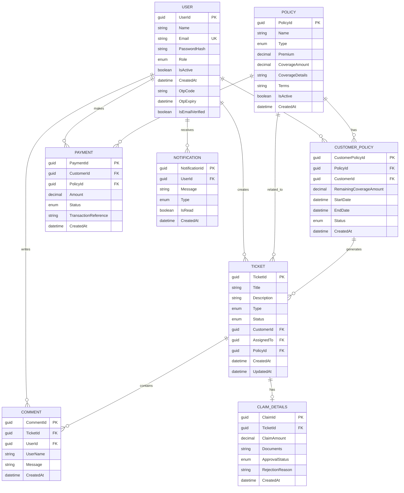
```mermaid
erDiagram
    USER ||--o{ CUSTOMER_POLICY : "purchases"
    USER ||--o{ TICKET : "creates"
    USER ||--o{ PAYMENT : "makes"
    USER ||--o{ NOTIFICATION : "receives"
    USER ||--o{ COMMENT : "writes"
    
    POLICY ||--o{ CUSTOMER_POLICY : "has"
    POLICY ||--o{ TICKET : "related_to"
    POLICY ||--o{ PAYMENT : "for"
    
    TICKET ||--o{ COMMENT : "contains"
    TICKET ||--o| CLAIM_DETAILS : "has"
    
    CUSTOMER_POLICY ||--o{ TICKET : "generates"
    
    USER {
        guid UserId PK
        string Name
        string Email UK
        string PasswordHash
        enum Role
        boolean IsActive
        datetime CreatedAt
        string OtpCode
        datetime OtpExpiry
        boolean IsEmailVerified
    }
    
    POLICY {
        guid PolicyId PK
        string Name
        enum Type
        decimal Premium
        decimal CoverageAmount
        string CoverageDetails
        string Terms
        boolean IsActive
        datetime CreatedAt
    }
    
    CUSTOMER_POLICY {
        guid CustomerPolicyId PK
        guid PolicyId FK
        guid CustomerId FK
        decimal RemainingCoverageAmount
        datetime StartDate
        datetime EndDate
        enum Status
        datetime CreatedAt
    }
    
    TICKET {
        guid TicketId PK
        string Title
        string Description
        enum Type
        enum Status
        guid CustomerId FK
        guid AssignedTo FK
        guid PolicyId FK
        datetime CreatedAt
        datetime UpdatedAt
    }
    
    CLAIM_DETAILS {
        guid ClaimId PK
        guid TicketId FK
        decimal ClaimAmount
        string Documents
        enum ApprovalStatus
        string RejectionReason
        datetime CreatedAt
    }
    
    COMMENT {
        guid CommentId PK
        guid TicketId FK
        guid UserId FK
        string UserName
        string Message
        datetime CreatedAt
    }
    
    PAYMENT {
        guid PaymentId PK
        guid CustomerId FK
        guid PolicyId FK
        decimal Amount
        enum Status
        string TransactionReference
        datetime CreatedAt
    }
    
    NOTIFICATION {
        guid NotificationId PK
        guid UserId FK
        string Message
        enum Type
        boolean IsRead
        datetime CreatedAt
    }
```

### 2.2 Entity Descriptions

#### User Entity
- **Primary Key:** UserId (GUID)
- **Unique Constraints:** Email
- **Relationships:** 
  - One-to-Many with CustomerPolicy
  - One-to-Many with Ticket
  - One-to-Many with Payment
  - One-to-Many with Notification

#### Policy Entity
- **Primary Key:** PolicyId (GUID)
- **Relationships:**
  - One-to-Many with CustomerPolicy
  - One-to-Many with Ticket (optional)

#### CustomerPolicy Entity
- **Primary Key:** CustomerPolicyId (GUID)
- **Foreign Keys:** PolicyId, CustomerId
- **Relationships:**
  - Many-to-One with User
  - Many-to-One with Policy

#### Ticket Entity
- **Primary Key:** TicketId (GUID)
- **Foreign Keys:** CustomerId, AssignedTo, PolicyId (optional)
- **Relationships:**
  - Many-to-One with User
  - One-to-Many with Comment
  - One-to-One with ClaimDetails (optional)

---

## 3. Component Diagram

### 3.1 High-Level Component Architecture

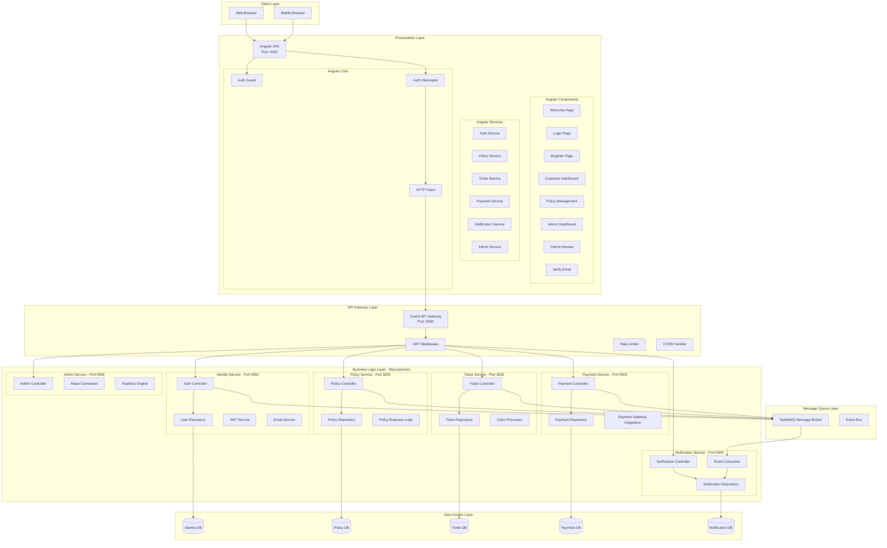
```mermaid
graph TB
    subgraph "Client Layer"
        Browser[Web Browser]
        Mobile[Mobile Browser]
    end
    
    subgraph "Presentation Layer"
        Angular[Angular SPA<br/>Port: 4200]
        
        subgraph "Angular Components"
            WelcomePage[Welcome Page]
            LoginPage[Login Page]
            RegisterPage[Register Page]
            CustomerDashboard[Customer Dashboard]
            PolicyMgmt[Policy Management]
            AdminDashboard[Admin Dashboard]
            ClaimsReview[Claims Review]
            VerifyEmail[Verify Email]
        end
        
        subgraph "Angular Services"
            AuthService[Auth Service]
            PolicyService[Policy Service]
            TicketService[Ticket Service]
            PaymentService[Payment Service]
            NotificationService[Notification Service]
            AdminService[Admin Service]
        end
        
        subgraph "Angular Core"
            AuthGuard[Auth Guard]
            AuthInterceptor[Auth Interceptor]
            HttpClient[HTTP Client]
        end
    end
    
    subgraph "API Gateway Layer"
        Gateway[Ocelot API Gateway<br/>Port: 5000]
        JWTMiddleware[JWT Middleware]
        RateLimiter[Rate Limiter]
        CORS[CORS Handler]
    end
    
    subgraph "Business Logic Layer - Microservices"
        subgraph "Identity Service - Port 5001"
            AuthController[Auth Controller]
            UserRepository[User Repository]
            JWTService[JWT Service]
            EmailService[Email Service]
        end
        
        subgraph "Policy Service - Port 5003"
            PolicyController[Policy Controller]
            PolicyRepo[Policy Repository]
            PolicyBusinessLogic[Policy Business Logic]
        end
        
        subgraph "Ticket Service - Port 5002"
            TicketController[Ticket Controller]
            TicketRepo[Ticket Repository]
            ClaimProcessor[Claim Processor]
        end
        
        subgraph "Payment Service - Port 5004"
            PaymentController[Payment Controller]
            PaymentRepo[Payment Repository]
            PaymentGateway[Payment Gateway Integration]
        end
        
        subgraph "Notification Service - Port 5005"
            NotificationController[Notification Controller]
            NotificationRepo[Notification Repository]
            EventConsumer[Event Consumer]
        end
        
        subgraph "Admin Service - Port 5006"
            AdminController[Admin Controller]
            ReportGenerator[Report Generator]
            AnalyticsEngine[Analytics Engine]
        end
    end
    
    subgraph "Data Access Layer"
        IdentityDB[(Identity DB)]
        PolicyDB[(Policy DB)]
        TicketDB[(Ticket DB)]
        PaymentDB[(Payment DB)]
        NotificationDB[(Notification DB)]
    end
    
    subgraph "Message Queue Layer"
        RabbitMQ[RabbitMQ Message Broker]
        EventBus[Event Bus]
    end
    
    Browser --> Angular
    Mobile --> Angular
    
    Angular --> AuthGuard
    Angular --> AuthInterceptor
    AuthInterceptor --> HttpClient
    HttpClient --> Gateway
    
    Gateway --> JWTMiddleware
    JWTMiddleware --> AuthController
    JWTMiddleware --> PolicyController
    JWTMiddleware --> TicketController
    JWTMiddleware --> PaymentController
    JWTMiddleware --> NotificationController
    JWTMiddleware --> AdminController
    
    AuthController --> UserRepository
    UserRepository --> IdentityDB
    
    PolicyController --> PolicyRepo
    PolicyRepo --> PolicyDB
    
    TicketController --> TicketRepo
    TicketRepo --> TicketDB
    
    PaymentController --> PaymentRepo
    PaymentRepo --> PaymentDB
    
    NotificationController --> NotificationRepo
    NotificationRepo --> NotificationDB
    
    AuthController --> RabbitMQ
    PolicyController --> RabbitMQ
    TicketController --> RabbitMQ
    PaymentController --> RabbitMQ
    
    RabbitMQ --> EventConsumer
    EventConsumer --> NotificationRepo
```

### 3.2 Component Responsibilities

#### Presentation Layer Components
- **Angular SPA:** User interface, routing, state management
- **Auth Guard:** Route protection based on authentication
- **Auth Interceptor:** Automatic JWT token injection
- **Services:** API communication, data transformation

#### API Gateway Components
- **Ocelot Gateway:** Request routing, load balancing
- **JWT Middleware:** Token validation
- **Rate Limiter:** Request throttling
- **CORS Handler:** Cross-origin request management

#### Microservice Components
- **Controllers:** HTTP request handling, validation
- **Repositories:** Data access abstraction
- **Business Logic:** Domain rules, calculations
- **Event Publishers:** Asynchronous communication

---

## 4. Deployment Diagram

### 4.1 Docker-Based Deployment

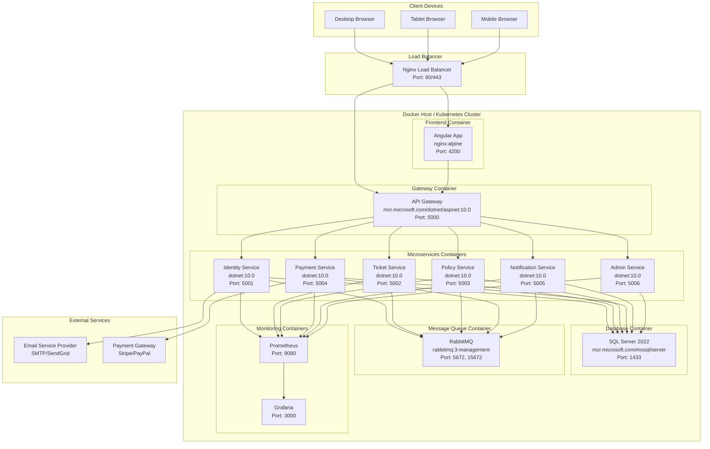
```mermaid
graph TB
    subgraph "Client Devices"
        Desktop[Desktop Browser]
        Tablet[Tablet Browser]
        Phone[Mobile Browser]
    end
    
    subgraph "Load Balancer"
        LB[Nginx Load Balancer<br/>Port: 80/443]
    end
    
    subgraph "Docker Host / Kubernetes Cluster"
        subgraph "Frontend Container"
            AngularContainer[Angular App<br/>nginx:alpine<br/>Port: 4200]
        end
        
        subgraph "Gateway Container"
            GatewayContainer[API Gateway<br/>mcr.microsoft.com/dotnet/aspnet:10.0<br/>Port: 5000]
        end
        
        subgraph "Microservices Containers"
            IdentityContainer[Identity Service<br/>dotnet:10.0<br/>Port: 5001]
            TicketContainer[Ticket Service<br/>dotnet:10.0<br/>Port: 5002]
            PolicyContainer[Policy Service<br/>dotnet:10.0<br/>Port: 5003]
            PaymentContainer[Payment Service<br/>dotnet:10.0<br/>Port: 5004]
            NotificationContainer[Notification Service<br/>dotnet:10.0<br/>Port: 5005]
            AdminContainer[Admin Service<br/>dotnet:10.0<br/>Port: 5006]
        end
        
        subgraph "Database Container"
            SQLServer[SQL Server 2022<br/>mcr.microsoft.com/mssql/server<br/>Port: 1433]
        end
        
        subgraph "Message Queue Container"
            RabbitMQContainer[RabbitMQ<br/>rabbitmq:3-management<br/>Port: 5672, 15672]
        end
        
        subgraph "Monitoring Containers"
            Prometheus[Prometheus<br/>Port: 9090]
            Grafana[Grafana<br/>Port: 3000]
        end
    end
    
    subgraph "External Services"
        EmailProvider[Email Service Provider<br/>SMTP/SendGrid]
        PaymentGatewayExt[Payment Gateway<br/>Stripe/PayPal]
    end
    
    Desktop --> LB
    Tablet --> LB
    Phone --> LB
    
    LB --> AngularContainer
    LB --> GatewayContainer
    
    AngularContainer --> GatewayContainer
    
    GatewayContainer --> IdentityContainer
    GatewayContainer --> TicketContainer
    GatewayContainer --> PolicyContainer
    GatewayContainer --> PaymentContainer
    GatewayContainer --> NotificationContainer
    GatewayContainer --> AdminContainer
    
    IdentityContainer --> SQLServer
    TicketContainer --> SQLServer
    PolicyContainer --> SQLServer
    PaymentContainer --> SQLServer
    NotificationContainer --> SQLServer
    AdminContainer --> SQLServer
    
    IdentityContainer --> RabbitMQContainer
    TicketContainer --> RabbitMQContainer
    PolicyContainer --> RabbitMQContainer
    PaymentContainer --> RabbitMQContainer
    NotificationContainer --> RabbitMQContainer
    
    IdentityContainer --> EmailProvider
    PaymentContainer --> PaymentGatewayExt
    
    IdentityContainer --> Prometheus
    TicketContainer --> Prometheus
    PolicyContainer --> Prometheus
    PaymentContainer --> Prometheus
    NotificationContainer --> Prometheus
    AdminContainer --> Prometheus
    
    Prometheus --> Grafana
```

### 4.2 Deployment Specifications

#### Container Specifications

| Container | Base Image | CPU | Memory | Replicas | Storage |
|-----------|------------|-----|--------|----------|---------|
| Angular App | nginx:alpine | 0.5 | 512MB | 2 | - |
| API Gateway | dotnet:10.0 | 1.0 | 1GB | 2 | - |
| Identity Service | dotnet:10.0 | 1.0 | 1GB | 2 | - |
| Ticket Service | dotnet:10.0 | 1.0 | 1GB | 2 | - |
| Policy Service | dotnet:10.0 | 1.0 | 1GB | 2 | - |
| Payment Service | dotnet:10.0 | 1.0 | 1GB | 2 | - |
| Notification Service | dotnet:10.0 | 0.5 | 512MB | 2 | - |
| Admin Service | dotnet:10.0 | 1.0 | 1GB | 1 | - |
| SQL Server | mssql:2022 | 2.0 | 4GB | 1 | 50GB |
| RabbitMQ | rabbitmq:3 | 1.0 | 2GB | 1 | 10GB |

#### Network Configuration
- **Frontend Network:** Public-facing (ports 80, 443)
- **Gateway Network:** Internal + Public (port 5000)
- **Service Network:** Internal only (ports 5001-5006)
- **Database Network:** Internal only (port 1433)
- **Message Queue Network:** Internal only (ports 5672, 15672)

---

## 5. Use Case Diagram

### 5.1 System Use Cases

```mermaid
graph LR
    subgraph "Actors"
        Customer[Customer]
        ClaimsSpecialist[Claims Specialist]
        SupportSpecialist[Support Specialist]
        Admin[Administrator]
        System[System/Scheduler]
    end
    
    subgraph "Authentication Use Cases"
        UC1[Register Account]
        UC2[Login]
        UC3[Verify Email]
        UC4[Logout]
        UC5[Reset Password]
    end
    
    subgraph "Policy Use Cases"
        UC6[Browse Policies]
        UC7[View Policy Details]
        UC8[Purchase Policy]
        UC9[View My Policies]
        UC10[Cancel Policy]
        UC11[Renew Policy]
        UC12[Manage Policies]
    end
    
    subgraph "Claim Use Cases"
        UC13[Submit Claim]
        UC14[Upload Documents]
        UC15[Track Claim Status]
        UC16[Review Claims]
        UC17[Approve Claim]
        UC18[Reject Claim]
    end
    
    subgraph "Support Use Cases"
        UC19[Create Support Ticket]
        UC20[View Tickets]
        UC21[Add Comment]
        UC22[Assign Ticket]
        UC23[Resolve Ticket]
        UC24[Close Ticket]
    end
    
    subgraph "Payment Use Cases"
        UC25[Make Payment]
        UC26[View Payment History]
        UC27[Process Refund]
        UC28[Generate Invoice]
    end
    
    subgraph "Notification Use Cases"
        UC29[View Notifications]
        UC30[Mark as Read]
        UC31[Send Notification]
    end
    
    subgraph "Admin Use Cases"
        UC32[View Dashboard]
        UC33[Generate Reports]
        UC34[Manage Users]
        UC35[View Analytics]
        UC36[Create Staff Account]
        UC37[System Configuration]
    end
    
    Customer --> UC1
    Customer --> UC2
    Customer --> UC3
    Customer --> UC6
    Customer --> UC7
    Customer --> UC8
    Customer --> UC9
    Customer --> UC10
    Customer --> UC13
    Customer --> UC14
    Customer --> UC15
    Customer --> UC19
    Customer --> UC20
    Customer --> UC21
    Customer --> UC25
    Customer --> UC26
    Customer --> UC29
    Customer --> UC30
    
    ClaimsSpecialist --> UC2
    ClaimsSpecialist --> UC16
    ClaimsSpecialist --> UC17
    ClaimsSpecialist --> UC18
    ClaimsSpecialist --> UC20
    ClaimsSpecialist --> UC21
    ClaimsSpecialist --> UC29
    
    SupportSpecialist --> UC2
    SupportSpecialist --> UC20
    SupportSpecialist --> UC21
    SupportSpecialist --> UC22
    SupportSpecialist --> UC23
    SupportSpecialist --> UC24
    SupportSpecialist --> UC29
    
    Admin --> UC2
    Admin --> UC12
    Admin --> UC32
    Admin --> UC33
    Admin --> UC34
    Admin --> UC35
    Admin --> UC36
    Admin --> UC37
    
    System --> UC31
    System --> UC11
    System --> UC28
```

### 5.2 Use Case Descriptions

#### UC8: Purchase Policy (Detailed)

**Actor:** Customer  
**Preconditions:** 
- User is logged in
- User has verified email
- Policy is active and available

**Main Flow:**
1. Customer browses available policies
2. Customer selects a policy
3. System displays policy details and premium
4. Customer clicks "Purchase"
5. System creates CustomerPolicy with status "PendingPayment"
6. System redirects to payment page
7. Customer enters payment details
8. System processes payment
9. System updates CustomerPolicy status to "Active"
10. System sends confirmation notification
11. System displays success message

**Alternative Flows:**
- **A1:** Payment fails
  - System displays error message
  - CustomerPolicy remains "PendingPayment"
  - Customer can retry payment

**Postconditions:**
- CustomerPolicy created with Active status
- Payment record created
- Notification sent to customer

---

## 6. Sequence Diagrams

### 6.1 Policy Purchase Flow

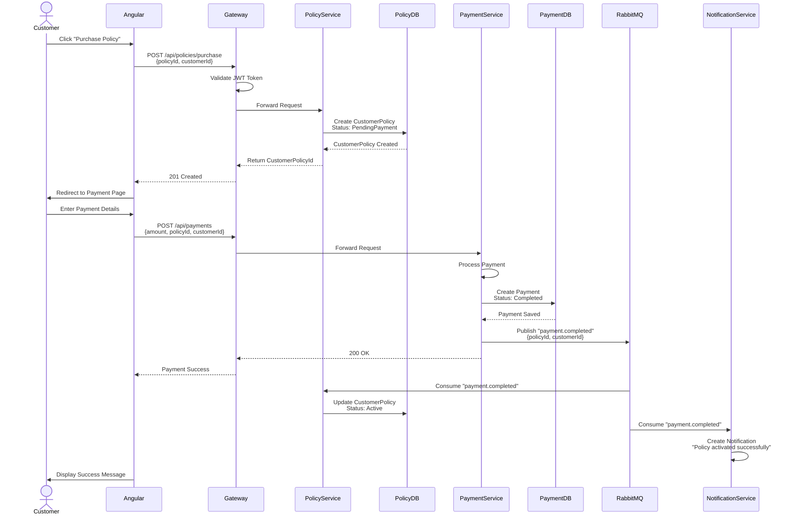
```mermaid
sequenceDiagram
    actor Customer
    participant Angular
    participant Gateway
    participant PolicyService
    participant PolicyDB
    participant PaymentService
    participant PaymentDB
    participant RabbitMQ
    participant NotificationService
    
    Customer->>Angular: Click "Purchase Policy"
    Angular->>Gateway: POST /api/policies/purchase<br/>{policyId, customerId}
    Gateway->>Gateway: Validate JWT Token
    Gateway->>PolicyService: Forward Request
    
    PolicyService->>PolicyDB: Create CustomerPolicy<br/>Status: PendingPayment
    PolicyDB-->>PolicyService: CustomerPolicy Created
    PolicyService-->>Gateway: Return CustomerPolicyId
    Gateway-->>Angular: 201 Created
    
    Angular->>Customer: Redirect to Payment Page
    Customer->>Angular: Enter Payment Details
    Angular->>Gateway: POST /api/payments<br/>{amount, policyId, customerId}
    Gateway->>PaymentService: Forward Request
    
    PaymentService->>PaymentService: Process Payment
    PaymentService->>PaymentDB: Create Payment<br/>Status: Completed
    PaymentDB-->>PaymentService: Payment Saved
    
    PaymentService->>RabbitMQ: Publish "payment.completed"<br/>{policyId, customerId}
    PaymentService-->>Gateway: 200 OK
    Gateway-->>Angular: Payment Success
    
    RabbitMQ->>PolicyService: Consume "payment.completed"
    PolicyService->>PolicyDB: Update CustomerPolicy<br/>Status: Active
    
    RabbitMQ->>NotificationService: Consume "payment.completed"
    NotificationService->>NotificationService: Create Notification<br/>"Policy activated successfully"
    
    Angular->>Customer: Display Success Message
```

### 6.2 Claim Approval Flow

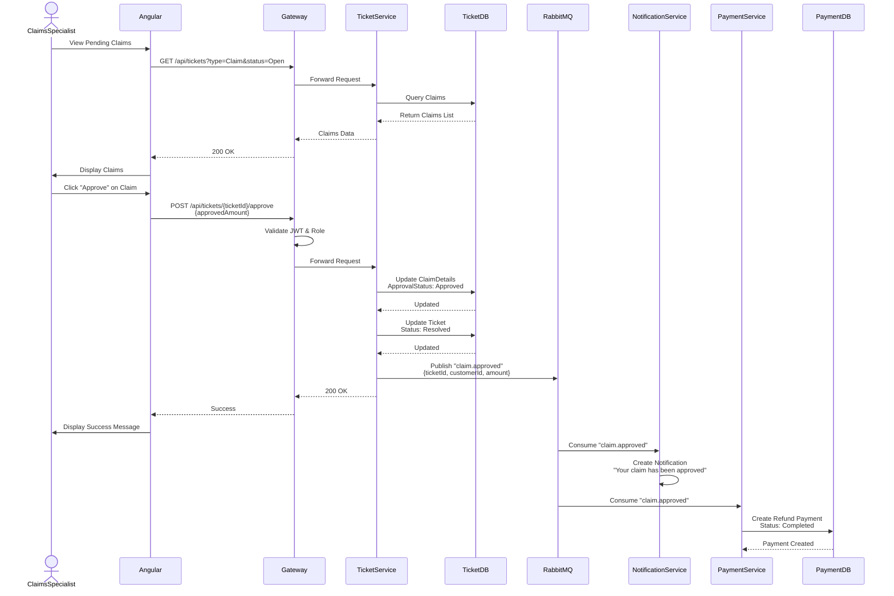
```mermaid
sequenceDiagram
    actor ClaimsSpecialist
    participant Angular
    participant Gateway
    participant TicketService
    participant TicketDB
    participant RabbitMQ
    participant NotificationService
    participant PaymentService
    participant PaymentDB
    
    ClaimsSpecialist->>Angular: View Pending Claims
    Angular->>Gateway: GET /api/tickets?type=Claim&status=Open
    Gateway->>TicketService: Forward Request
    TicketService->>TicketDB: Query Claims
    TicketDB-->>TicketService: Return Claims List
    TicketService-->>Gateway: Claims Data
    Gateway-->>Angular: 200 OK
    Angular->>ClaimsSpecialist: Display Claims
    
    ClaimsSpecialist->>Angular: Click "Approve" on Claim
    Angular->>Gateway: POST /api/tickets/{ticketId}/approve<br/>{approvedAmount}
    Gateway->>Gateway: Validate JWT & Role
    Gateway->>TicketService: Forward Request
    
    TicketService->>TicketDB: Update ClaimDetails<br/>ApprovalStatus: Approved
    TicketDB-->>TicketService: Updated
    
    TicketService->>TicketDB: Update Ticket<br/>Status: Resolved
    TicketDB-->>TicketService: Updated
    
    TicketService->>RabbitMQ: Publish "claim.approved"<br/>{ticketId, customerId, amount}
    TicketService-->>Gateway: 200 OK
    Gateway-->>Angular: Success
    Angular->>ClaimsSpecialist: Display Success Message
    
    RabbitMQ->>NotificationService: Consume "claim.approved"
    NotificationService->>NotificationService: Create Notification<br/>"Your claim has been approved"
    
    RabbitMQ->>PaymentService: Consume "claim.approved"
    PaymentService->>PaymentDB: Create Refund Payment<br/>Status: Completed
    PaymentDB-->>PaymentService: Payment Created
```

### 6.3 User Registration & Email Verification Flow

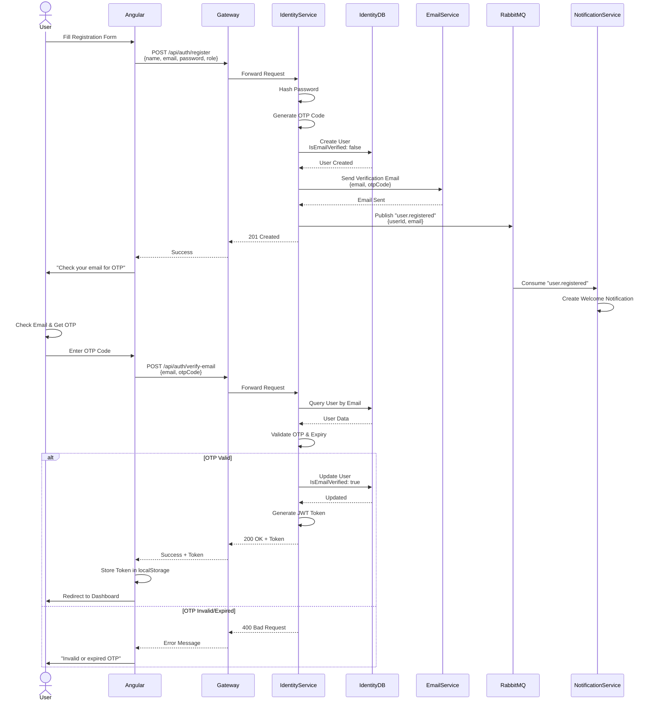
```mermaid
sequenceDiagram
    actor User
    participant Angular
    participant Gateway
    participant IdentityService
    participant IdentityDB
    participant EmailService
    participant RabbitMQ
    participant NotificationService
    
    User->>Angular: Fill Registration Form
    Angular->>Gateway: POST /api/auth/register<br/>{name, email, password, role}
    Gateway->>IdentityService: Forward Request
    
    IdentityService->>IdentityService: Hash Password
    IdentityService->>IdentityService: Generate OTP Code
    IdentityService->>IdentityDB: Create User<br/>IsEmailVerified: false
    IdentityDB-->>IdentityService: User Created
    
    IdentityService->>EmailService: Send Verification Email<br/>{email, otpCode}
    EmailService-->>IdentityService: Email Sent
    
    IdentityService->>RabbitMQ: Publish "user.registered"<br/>{userId, email}
    IdentityService-->>Gateway: 201 Created
    Gateway-->>Angular: Success
    Angular->>User: "Check your email for OTP"
    
    RabbitMQ->>NotificationService: Consume "user.registered"
    NotificationService->>NotificationService: Create Welcome Notification
    
    User->>User: Check Email & Get OTP
    User->>Angular: Enter OTP Code
    Angular->>Gateway: POST /api/auth/verify-email<br/>{email, otpCode}
    Gateway->>IdentityService: Forward Request
    
    IdentityService->>IdentityDB: Query User by Email
    IdentityDB-->>IdentityService: User Data
    IdentityService->>IdentityService: Validate OTP & Expiry
    
    alt OTP Valid
        IdentityService->>IdentityDB: Update User<br/>IsEmailVerified: true
        IdentityDB-->>IdentityService: Updated
        IdentityService->>IdentityService: Generate JWT Token
        IdentityService-->>Gateway: 200 OK + Token
        Gateway-->>Angular: Success + Token
        Angular->>Angular: Store Token in localStorage
        Angular->>User: Redirect to Dashboard
    else OTP Invalid/Expired
        IdentityService-->>Gateway: 400 Bad Request
        Gateway-->>Angular: Error Message
        Angular->>User: "Invalid or expired OTP"
    end
```

### 6.4 Payment & Refund Flow

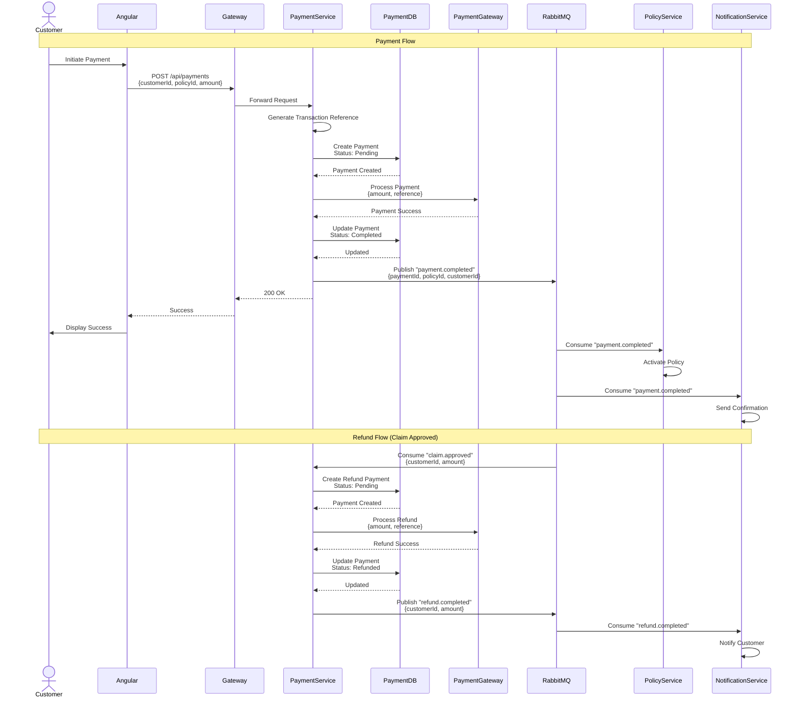
```mermaid
sequenceDiagram
    actor Customer
    participant Angular
    participant Gateway
    participant PaymentService
    participant PaymentDB
    participant PaymentGateway
    participant RabbitMQ
    participant PolicyService
    participant NotificationService
    
    Note over Customer,NotificationService: Payment Flow
    
    Customer->>Angular: Initiate Payment
    Angular->>Gateway: POST /api/payments<br/>{customerId, policyId, amount}
    Gateway->>PaymentService: Forward Request
    
    PaymentService->>PaymentService: Generate Transaction Reference
    PaymentService->>PaymentDB: Create Payment<br/>Status: Pending
    PaymentDB-->>PaymentService: Payment Created
    
    PaymentService->>PaymentGateway: Process Payment<br/>{amount, reference}
    PaymentGateway-->>PaymentService: Payment Success
    
    PaymentService->>PaymentDB: Update Payment<br/>Status: Completed
    PaymentDB-->>PaymentService: Updated
    
    PaymentService->>RabbitMQ: Publish "payment.completed"<br/>{paymentId, policyId, customerId}
    PaymentService-->>Gateway: 200 OK
    Gateway-->>Angular: Success
    Angular->>Customer: Display Success
    
    RabbitMQ->>PolicyService: Consume "payment.completed"
    PolicyService->>PolicyService: Activate Policy
    
    RabbitMQ->>NotificationService: Consume "payment.completed"
    NotificationService->>NotificationService: Send Confirmation
    
    Note over Customer,NotificationService: Refund Flow (Claim Approved)
    
    RabbitMQ->>PaymentService: Consume "claim.approved"<br/>{customerId, amount}
    PaymentService->>PaymentDB: Create Refund Payment<br/>Status: Pending
    PaymentDB-->>PaymentService: Payment Created
    
    PaymentService->>PaymentGateway: Process Refund<br/>{amount, reference}
    PaymentGateway-->>PaymentService: Refund Success
    
    PaymentService->>PaymentDB: Update Payment<br/>Status: Refunded
    PaymentDB-->>PaymentService: Updated
    
    PaymentService->>RabbitMQ: Publish "refund.completed"<br/>{customerId, amount}
    
    RabbitMQ->>NotificationService: Consume "refund.completed"
    NotificationService->>NotificationService: Notify Customer
```

### 6.5 Support Ticket Creation Flow

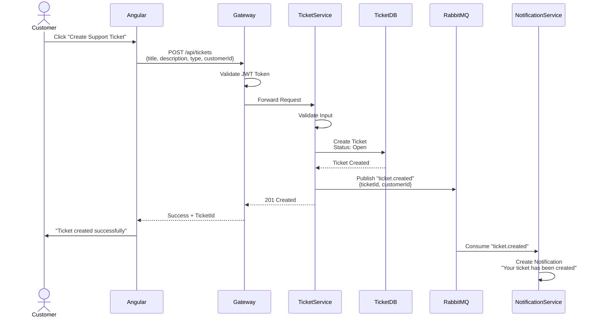
```mermaid
sequenceDiagram
    actor Customer
    participant Angular
    participant Gateway
    participant TicketService
    participant TicketDB
    participant RabbitMQ
    participant NotificationService
    
    Customer->>Angular: Click "Create Support Ticket"
    Angular->>Gateway: POST /api/tickets<br/>{title, description, type, customerId}
    Gateway->>Gateway: Validate JWT Token
    Gateway->>TicketService: Forward Request
    
    TicketService->>TicketService: Validate Input
    TicketService->>TicketDB: Create Ticket<br/>Status: Open
    TicketDB-->>TicketService: Ticket Created
    
    TicketService->>RabbitMQ: Publish "ticket.created"<br/>{ticketId, customerId}
    TicketService-->>Gateway: 201 Created
    Gateway-->>Angular: Success + TicketId
    Angular->>Customer: "Ticket created successfully"
    
    RabbitMQ->>NotificationService: Consume "ticket.created"
    NotificationService->>NotificationService: Create Notification<br/>"Your ticket has been created"
```

---

## 7. Class Diagrams

### 7.1 Identity Service Class Diagram

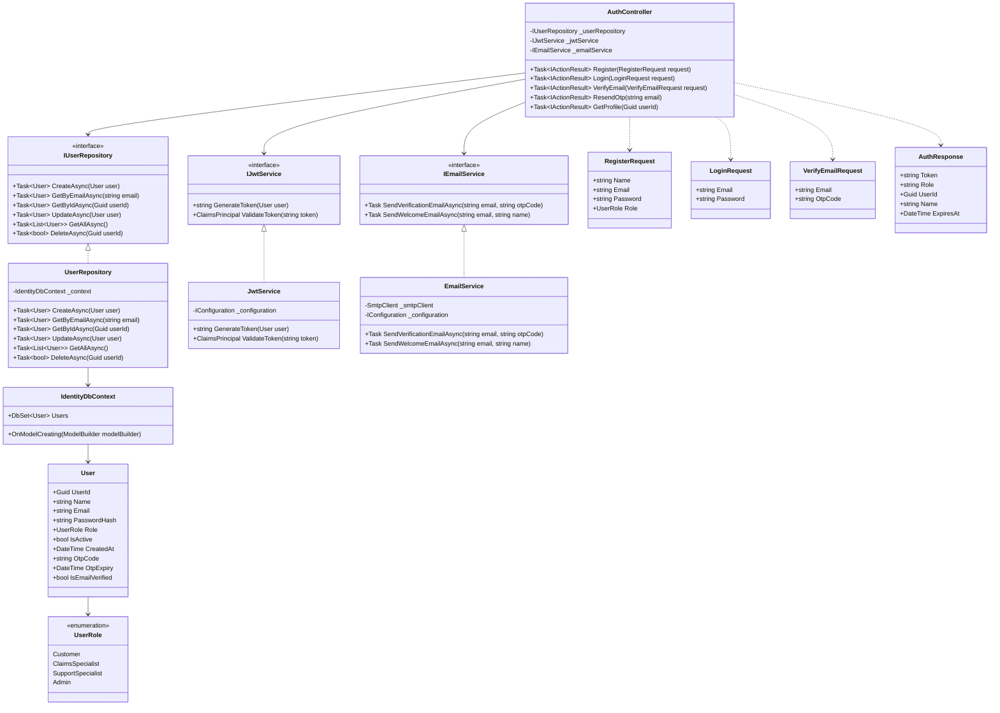
```mermaid
classDiagram
    class User {
        +Guid UserId
        +string Name
        +string Email
        +string PasswordHash
        +UserRole Role
        +bool IsActive
        +DateTime CreatedAt
        +string OtpCode
        +DateTime OtpExpiry
        +bool IsEmailVerified
    }
    
    class UserRole {
        <<enumeration>>
        Customer
        ClaimsSpecialist
        SupportSpecialist
        Admin
    }
    
    class AuthController {
        -IUserRepository _userRepository
        -IJwtService _jwtService
        -IEmailService _emailService
        +Task~IActionResult~ Register(RegisterRequest request)
        +Task~IActionResult~ Login(LoginRequest request)
        +Task~IActionResult~ VerifyEmail(VerifyEmailRequest request)
        +Task~IActionResult~ ResendOtp(string email)
        +Task~IActionResult~ GetProfile(Guid userId)
    }
    
    class IUserRepository {
        <<interface>>
        +Task~User~ CreateAsync(User user)
        +Task~User~ GetByEmailAsync(string email)
        +Task~User~ GetByIdAsync(Guid userId)
        +Task~User~ UpdateAsync(User user)
        +Task~List~User~~ GetAllAsync()
        +Task~bool~ DeleteAsync(Guid userId)
    }
    
    class UserRepository {
        -IdentityDbContext _context
        +Task~User~ CreateAsync(User user)
        +Task~User~ GetByEmailAsync(string email)
        +Task~User~ GetByIdAsync(Guid userId)
        +Task~User~ UpdateAsync(User user)
        +Task~List~User~~ GetAllAsync()
        +Task~bool~ DeleteAsync(Guid userId)
    }
    
    class IJwtService {
        <<interface>>
        +string GenerateToken(User user)
        +ClaimsPrincipal ValidateToken(string token)
    }
    
    class JwtService {
        -IConfiguration _configuration
        +string GenerateToken(User user)
        +ClaimsPrincipal ValidateToken(string token)
    }
    
    class IEmailService {
        <<interface>>
        +Task SendVerificationEmailAsync(string email, string otpCode)
        +Task SendWelcomeEmailAsync(string email, string name)
    }
    
    class EmailService {
        -SmtpClient _smtpClient
        -IConfiguration _configuration
        +Task SendVerificationEmailAsync(string email, string otpCode)
        +Task SendWelcomeEmailAsync(string email, string name)
    }
    
    class IdentityDbContext {
        +DbSet~User~ Users
        +OnModelCreating(ModelBuilder modelBuilder)
    }
    
    class RegisterRequest {
        +string Name
        +string Email
        +string Password
        +UserRole Role
    }
    
    class LoginRequest {
        +string Email
        +string Password
    }
    
    class VerifyEmailRequest {
        +string Email
        +string OtpCode
    }
    
    class AuthResponse {
        +string Token
        +string Role
        +Guid UserId
        +string Name
        +DateTime ExpiresAt
    }
    
    User --> UserRole
    AuthController --> IUserRepository
    AuthController --> IJwtService
    AuthController --> IEmailService
    AuthController ..> RegisterRequest
    AuthController ..> LoginRequest
    AuthController ..> VerifyEmailRequest
    AuthController ..> AuthResponse
    IUserRepository <|.. UserRepository
    IJwtService <|.. JwtService
    IEmailService <|.. EmailService
    UserRepository --> IdentityDbContext
    IdentityDbContext --> User
```

### 7.2 Policy Service Class Diagram

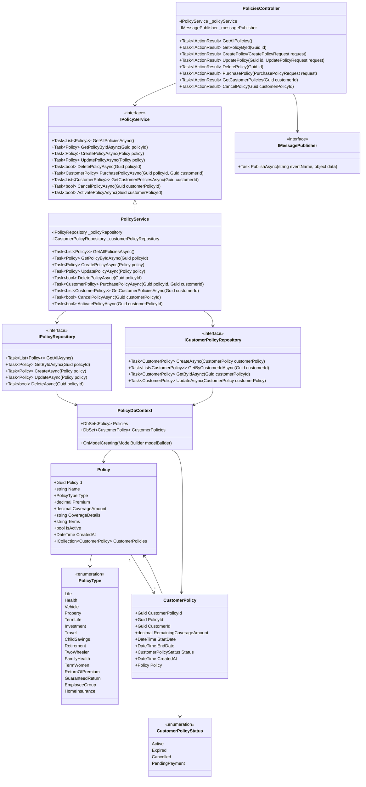
```mermaid
classDiagram
    class Policy {
        +Guid PolicyId
        +string Name
        +PolicyType Type
        +decimal Premium
        +decimal CoverageAmount
        +string CoverageDetails
        +string Terms
        +bool IsActive
        +DateTime CreatedAt
        +ICollection~CustomerPolicy~ CustomerPolicies
    }
    
    class PolicyType {
        <<enumeration>>
        Life
        Health
        Vehicle
        Property
        TermLife
        Investment
        Travel
        ChildSavings
        Retirement
        TwoWheeler
        FamilyHealth
        TermWomen
        ReturnOfPremium
        GuaranteedReturn
        EmployeeGroup
        HomeInsurance
    }
    
    class CustomerPolicy {
        +Guid CustomerPolicyId
        +Guid PolicyId
        +Guid CustomerId
        +decimal RemainingCoverageAmount
        +DateTime StartDate
        +DateTime EndDate
        +CustomerPolicyStatus Status
        +DateTime CreatedAt
        +Policy Policy
    }
    
    class CustomerPolicyStatus {
        <<enumeration>>
        Active
        Expired
        Cancelled
        PendingPayment
    }
    
    class PoliciesController {
        -IPolicyService _policyService
        -IMessagePublisher _messagePublisher
        +Task~IActionResult~ GetAllPolicies()
        +Task~IActionResult~ GetPolicyById(Guid id)
        +Task~IActionResult~ CreatePolicy(CreatePolicyRequest request)
        +Task~IActionResult~ UpdatePolicy(Guid id, UpdatePolicyRequest request)
        +Task~IActionResult~ DeletePolicy(Guid id)
        +Task~IActionResult~ PurchasePolicy(PurchasePolicyRequest request)
        +Task~IActionResult~ GetCustomerPolicies(Guid customerId)
        +Task~IActionResult~ CancelPolicy(Guid customerPolicyId)
    }
    
    class IPolicyService {
        <<interface>>
        +Task~List~Policy~~ GetAllPoliciesAsync()
        +Task~Policy~ GetPolicyByIdAsync(Guid policyId)
        +Task~Policy~ CreatePolicyAsync(Policy policy)
        +Task~Policy~ UpdatePolicyAsync(Policy policy)
        +Task~bool~ DeletePolicyAsync(Guid policyId)
        +Task~CustomerPolicy~ PurchasePolicyAsync(Guid policyId, Guid customerId)
        +Task~List~CustomerPolicy~~ GetCustomerPoliciesAsync(Guid customerId)
        +Task~bool~ CancelPolicyAsync(Guid customerPolicyId)
        +Task~bool~ ActivatePolicyAsync(Guid customerPolicyId)
    }
    
    class PolicyService {
        -IPolicyRepository _policyRepository
        -ICustomerPolicyRepository _customerPolicyRepository
        +Task~List~Policy~~ GetAllPoliciesAsync()
        +Task~Policy~ GetPolicyByIdAsync(Guid policyId)
        +Task~Policy~ CreatePolicyAsync(Policy policy)
        +Task~Policy~ UpdatePolicyAsync(Policy policy)
        +Task~bool~ DeletePolicyAsync(Guid policyId)
        +Task~CustomerPolicy~ PurchasePolicyAsync(Guid policyId, Guid customerId)
        +Task~List~CustomerPolicy~~ GetCustomerPoliciesAsync(Guid customerId)
        +Task~bool~ CancelPolicyAsync(Guid customerPolicyId)
        +Task~bool~ ActivatePolicyAsync(Guid customerPolicyId)
    }
    
    class IPolicyRepository {
        <<interface>>
        +Task~List~Policy~~ GetAllAsync()
        +Task~Policy~ GetByIdAsync(Guid policyId)
        +Task~Policy~ CreateAsync(Policy policy)
        +Task~Policy~ UpdateAsync(Policy policy)
        +Task~bool~ DeleteAsync(Guid policyId)
    }
    
    class ICustomerPolicyRepository {
        <<interface>>
        +Task~CustomerPolicy~ CreateAsync(CustomerPolicy customerPolicy)
        +Task~List~CustomerPolicy~~ GetByCustomerIdAsync(Guid customerId)
        +Task~CustomerPolicy~ GetByIdAsync(Guid customerPolicyId)
        +Task~CustomerPolicy~ UpdateAsync(CustomerPolicy customerPolicy)
    }
    
    class PolicyDbContext {
        +DbSet~Policy~ Policies
        +DbSet~CustomerPolicy~ CustomerPolicies
        +OnModelCreating(ModelBuilder modelBuilder)
    }
    
    class IMessagePublisher {
        <<interface>>
        +Task PublishAsync(string eventName, object data)
    }
    
    Policy --> PolicyType
    Policy "1" --> "*" CustomerPolicy
    CustomerPolicy --> CustomerPolicyStatus
    CustomerPolicy --> Policy
    PoliciesController --> IPolicyService
    PoliciesController --> IMessagePublisher
    IPolicyService <|.. PolicyService
    PolicyService --> IPolicyRepository
    PolicyService --> ICustomerPolicyRepository
    IPolicyRepository --> PolicyDbContext
    ICustomerPolicyRepository --> PolicyDbContext
    PolicyDbContext --> Policy
    PolicyDbContext --> CustomerPolicy
```

### 7.3 Ticket Service Class Diagram

```mermaid
classDiagram
    class Ticket {
        +Guid TicketId
        +string Title
        +string Description
        +TicketType Type
        +TicketStatus Status
        +Guid CustomerId
        +Guid AssignedTo
        +Guid PolicyId
        +DateTime CreatedAt
        +DateTime UpdatedAt
        +ICollection~Comment~ Comments
        +ClaimDetails ClaimDetails
    }
    
    class TicketType {
        <<enumeration>>
        Support
        Claim
    }
    
    class TicketStatus {
        <<enumeration>>
        Open
        InProgress
        Resolved
        Closed
    }
    
    class Comment {
        +Guid CommentId
        +Guid TicketId
        +Guid UserId
        +string UserName
        +string Message
        +DateTime CreatedAt
        +Ticket Ticket
    }
    
    class ClaimDetails {
        +Guid ClaimId
        +Guid TicketId
        +decimal ClaimAmount
        +string Documents
        +ApprovalStatus ApprovalStatus
        +string RejectionReason
        +DateTime CreatedAt
        +Ticket Ticket
    }
    
    class ApprovalStatus {
        <<enumeration>>
        Pending
        Approved
        Rejected
    }
    
    class TicketsController {
        -ITicketService _ticketService
        -IMessagePublisher _messagePublisher
        +Task~IActionResult~ GetAllTickets(Guid userId, string role)
        +Task~IActionResult~ GetTicketById(Guid ticketId)
        +Task~IActionResult~ CreateTicket(CreateTicketRequest request)
        +Task~IActionResult~ AddComment(Guid ticketId, AddCommentRequest request)
        +Task~IActionResult~ ApproveClaim(Guid ticketId, ApproveClaimRequest request)
        +Task~IActionResult~ RejectClaim(Guid ticketId, RejectClaimRequest request)
        +Task~IActionResult~ AssignTicket(Guid ticketId, Guid specialistId)
        +Task~IActionResult~ UpdateStatus(Guid ticketId, TicketStatus status)
    }
    
    class ITicketService {
        <<interface>>
        +Task~List~Ticket~~ GetAllTicketsAsync(Guid userId, string role)
        +Task~Ticket~ GetTicketByIdAsync(Guid ticketId)
        +Task~Ticket~ CreateTicketAsync(Ticket ticket)
        +Task~Comment~ AddCommentAsync(Comment comment)
        +Task~bool~ ApproveClaimAsync(Guid ticketId, decimal approvedAmount)
        +Task~bool~ RejectClaimAsync(Guid ticketId, string reason)
        +Task~bool~ AssignTicketAsync(Guid ticketId, Guid specialistId)
        +Task~bool~ UpdateStatusAsync(Guid ticketId, TicketStatus status)
    }
    
    class TicketService {
        -ITicketRepository _ticketRepository
        -ICommentRepository _commentRepository
        -IClaimRepository _claimRepository
        +Task~List~Ticket~~ GetAllTicketsAsync(Guid userId, string role)
        +Task~Ticket~ GetTicketByIdAsync(Guid ticketId)
        +Task~Ticket~ CreateTicketAsync(Ticket ticket)
        +Task~Comment~ AddCommentAsync(Comment comment)
        +Task~bool~ ApproveClaimAsync(Guid ticketId, decimal approvedAmount)
        +Task~bool~ RejectClaimAsync(Guid ticketId, string reason)
        +Task~bool~ AssignTicketAsync(Guid ticketId, Guid specialistId)
        +Task~bool~ UpdateStatusAsync(Guid ticketId, TicketStatus status)
    }
    
    class ITicketRepository {
        <<interface>>
        +Task~List~Ticket~~ GetAllAsync()
        +Task~List~Ticket~~ GetByCustomerIdAsync(Guid customerId)
        +Task~List~Ticket~~ GetByAssignedToAsync(Guid specialistId)
        +Task~Ticket~ GetByIdAsync(Guid ticketId)
        +Task~Ticket~ CreateAsync(Ticket ticket)
        +Task~Ticket~ UpdateAsync(Ticket ticket)
    }
    
    class TicketDbContext {
        +DbSet~Ticket~ Tickets
        +DbSet~Comment~ Comments
        +DbSet~ClaimDetails~ ClaimDetails
        +OnModelCreating(ModelBuilder modelBuilder)
    }
    
    Ticket --> TicketType
    Ticket --> TicketStatus
    Ticket "1" --> "*" Comment
    Ticket "1" --> "0..1" ClaimDetails
    ClaimDetails --> ApprovalStatus
    TicketsController --> ITicketService
    TicketsController --> IMessagePublisher
    ITicketService <|.. TicketService
    TicketService --> ITicketRepository
    ITicketRepository --> TicketDbContext
    TicketDbContext --> Ticket
    TicketDbContext --> Comment
    TicketDbContext --> ClaimDetails
```

### 7.4 Payment Service Class Diagram

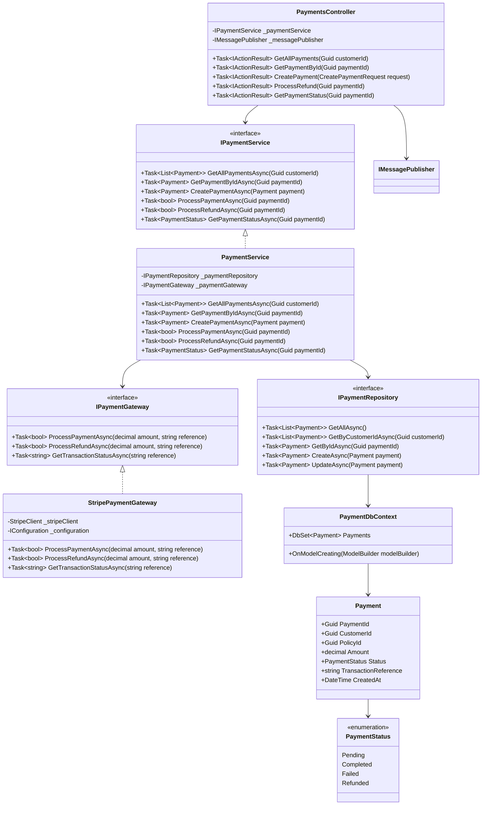
```mermaid
classDiagram
    class Payment {
        +Guid PaymentId
        +Guid CustomerId
        +Guid PolicyId
        +decimal Amount
        +PaymentStatus Status
        +string TransactionReference
        +DateTime CreatedAt
    }
    
    class PaymentStatus {
        <<enumeration>>
        Pending
        Completed
        Failed
        Refunded
    }
    
    class PaymentsController {
        -IPaymentService _paymentService
        -IMessagePublisher _messagePublisher
        +Task~IActionResult~ GetAllPayments(Guid customerId)
        +Task~IActionResult~ GetPaymentById(Guid paymentId)
        +Task~IActionResult~ CreatePayment(CreatePaymentRequest request)
        +Task~IActionResult~ ProcessRefund(Guid paymentId)
        +Task~IActionResult~ GetPaymentStatus(Guid paymentId)
    }
    
    class IPaymentService {
        <<interface>>
        +Task~List~Payment~~ GetAllPaymentsAsync(Guid customerId)
        +Task~Payment~ GetPaymentByIdAsync(Guid paymentId)
        +Task~Payment~ CreatePaymentAsync(Payment payment)
        +Task~bool~ ProcessPaymentAsync(Guid paymentId)
        +Task~bool~ ProcessRefundAsync(Guid paymentId)
        +Task~PaymentStatus~ GetPaymentStatusAsync(Guid paymentId)
    }
    
    class PaymentService {
        -IPaymentRepository _paymentRepository
        -IPaymentGateway _paymentGateway
        +Task~List~Payment~~ GetAllPaymentsAsync(Guid customerId)
        +Task~Payment~ GetPaymentByIdAsync(Guid paymentId)
        +Task~Payment~ CreatePaymentAsync(Payment payment)
        +Task~bool~ ProcessPaymentAsync(Guid paymentId)
        +Task~bool~ ProcessRefundAsync(Guid paymentId)
        +Task~PaymentStatus~ GetPaymentStatusAsync(Guid paymentId)
    }
    
    class IPaymentRepository {
        <<interface>>
        +Task~List~Payment~~ GetAllAsync()
        +Task~List~Payment~~ GetByCustomerIdAsync(Guid customerId)
        +Task~Payment~ GetByIdAsync(Guid paymentId)
        +Task~Payment~ CreateAsync(Payment payment)
        +Task~Payment~ UpdateAsync(Payment payment)
    }
    
    class IPaymentGateway {
        <<interface>>
        +Task~bool~ ProcessPaymentAsync(decimal amount, string reference)
        +Task~bool~ ProcessRefundAsync(decimal amount, string reference)
        +Task~string~ GetTransactionStatusAsync(string reference)
    }
    
    class StripePaymentGateway {
        -StripeClient _stripeClient
        -IConfiguration _configuration
        +Task~bool~ ProcessPaymentAsync(decimal amount, string reference)
        +Task~bool~ ProcessRefundAsync(decimal amount, string reference)
        +Task~string~ GetTransactionStatusAsync(string reference)
    }
    
    class PaymentDbContext {
        +DbSet~Payment~ Payments
        +OnModelCreating(ModelBuilder modelBuilder)
    }
    
    Payment --> PaymentStatus
    PaymentsController --> IPaymentService
    PaymentsController --> IMessagePublisher
    IPaymentService <|.. PaymentService
    PaymentService --> IPaymentRepository
    PaymentService --> IPaymentGateway
    IPaymentGateway <|.. StripePaymentGateway
    IPaymentRepository --> PaymentDbContext
    PaymentDbContext --> Payment
```

### 7.5 Notification Service Class Diagram

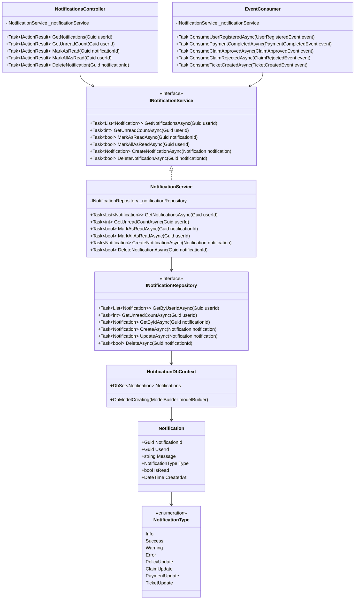
```mermaid
classDiagram
    class Notification {
        +Guid NotificationId
        +Guid UserId
        +string Message
        +NotificationType Type
        +bool IsRead
        +DateTime CreatedAt
    }
    
    class NotificationType {
        <<enumeration>>
        Info
        Success
        Warning
        Error
        PolicyUpdate
        ClaimUpdate
        PaymentUpdate
        TicketUpdate
    }
    
    class NotificationsController {
        -INotificationService _notificationService
        +Task~IActionResult~ GetNotifications(Guid userId)
        +Task~IActionResult~ GetUnreadCount(Guid userId)
        +Task~IActionResult~ MarkAsRead(Guid notificationId)
        +Task~IActionResult~ MarkAllAsRead(Guid userId)
        +Task~IActionResult~ DeleteNotification(Guid notificationId)
    }
    
    class INotificationService {
        <<interface>>
        +Task~List~Notification~~ GetNotificationsAsync(Guid userId)
        +Task~int~ GetUnreadCountAsync(Guid userId)
        +Task~bool~ MarkAsReadAsync(Guid notificationId)
        +Task~bool~ MarkAllAsReadAsync(Guid userId)
        +Task~Notification~ CreateNotificationAsync(Notification notification)
        +Task~bool~ DeleteNotificationAsync(Guid notificationId)
    }
    
    class NotificationService {
        -INotificationRepository _notificationRepository
        +Task~List~Notification~~ GetNotificationsAsync(Guid userId)
        +Task~int~ GetUnreadCountAsync(Guid userId)
        +Task~bool~ MarkAsReadAsync(Guid notificationId)
        +Task~bool~ MarkAllAsReadAsync(Guid userId)
        +Task~Notification~ CreateNotificationAsync(Notification notification)
        +Task~bool~ DeleteNotificationAsync(Guid notificationId)
    }
    
    class INotificationRepository {
        <<interface>>
        +Task~List~Notification~~ GetByUserIdAsync(Guid userId)
        +Task~int~ GetUnreadCountAsync(Guid userId)
        +Task~Notification~ GetByIdAsync(Guid notificationId)
        +Task~Notification~ CreateAsync(Notification notification)
        +Task~Notification~ UpdateAsync(Notification notification)
        +Task~bool~ DeleteAsync(Guid notificationId)
    }
    
    class EventConsumer {
        -INotificationService _notificationService
        +Task ConsumeUserRegisteredAsync(UserRegisteredEvent event)
        +Task ConsumePaymentCompletedAsync(PaymentCompletedEvent event)
        +Task ConsumeClaimApprovedAsync(ClaimApprovedEvent event)
        +Task ConsumeClaimRejectedAsync(ClaimRejectedEvent event)
        +Task ConsumeTicketCreatedAsync(TicketCreatedEvent event)
    }
    
    class NotificationDbContext {
        +DbSet~Notification~ Notifications
        +OnModelCreating(ModelBuilder modelBuilder)
    }
    
    Notification --> NotificationType
    NotificationsController --> INotificationService
    INotificationService <|.. NotificationService
    NotificationService --> INotificationRepository
    EventConsumer --> INotificationService
    INotificationRepository --> NotificationDbContext
    NotificationDbContext --> Notification
```

### 7.6 Admin Service Class Diagram

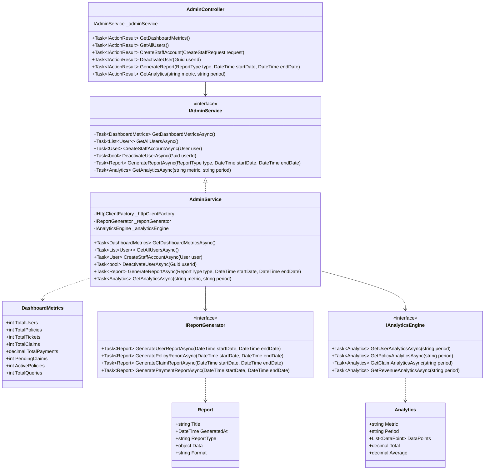
```mermaid
classDiagram
    class AdminController {
        -IAdminService _adminService
        +Task~IActionResult~ GetDashboardMetrics()
        +Task~IActionResult~ GetAllUsers()
        +Task~IActionResult~ CreateStaffAccount(CreateStaffRequest request)
        +Task~IActionResult~ DeactivateUser(Guid userId)
        +Task~IActionResult~ GenerateReport(ReportType type, DateTime startDate, DateTime endDate)
        +Task~IActionResult~ GetAnalytics(string metric, string period)
    }
    
    class IAdminService {
        <<interface>>
        +Task~DashboardMetrics~ GetDashboardMetricsAsync()
        +Task~List~User~~ GetAllUsersAsync()
        +Task~User~ CreateStaffAccountAsync(User user)
        +Task~bool~ DeactivateUserAsync(Guid userId)
        +Task~Report~ GenerateReportAsync(ReportType type, DateTime startDate, DateTime endDate)
        +Task~Analytics~ GetAnalyticsAsync(string metric, string period)
    }
    
    class AdminService {
        -IHttpClientFactory _httpClientFactory
        -IReportGenerator _reportGenerator
        -IAnalyticsEngine _analyticsEngine
        +Task~DashboardMetrics~ GetDashboardMetricsAsync()
        +Task~List~User~~ GetAllUsersAsync()
        +Task~User~ CreateStaffAccountAsync(User user)
        +Task~bool~ DeactivateUserAsync(Guid userId)
        +Task~Report~ GenerateReportAsync(ReportType type, DateTime startDate, DateTime endDate)
        +Task~Analytics~ GetAnalyticsAsync(string metric, string period)
    }
    
    class DashboardMetrics {
        +int TotalUsers
        +int TotalPolicies
        +int TotalTickets
        +int TotalClaims
        +decimal TotalPayments
        +int PendingClaims
        +int ActivePolicies
        +int TotalQueries
    }
    
    class IReportGenerator {
        <<interface>>
        +Task~Report~ GenerateUserReportAsync(DateTime startDate, DateTime endDate)
        +Task~Report~ GeneratePolicyReportAsync(DateTime startDate, DateTime endDate)
        +Task~Report~ GenerateClaimReportAsync(DateTime startDate, DateTime endDate)
        +Task~Report~ GeneratePaymentReportAsync(DateTime startDate, DateTime endDate)
    }
    
    class IAnalyticsEngine {
        <<interface>>
        +Task~Analytics~ GetUserAnalyticsAsync(string period)
        +Task~Analytics~ GetPolicyAnalyticsAsync(string period)
        +Task~Analytics~ GetClaimAnalyticsAsync(string period)
        +Task~Analytics~ GetRevenueAnalyticsAsync(string period)
    }
    
    class Report {
        +string Title
        +DateTime GeneratedAt
        +string ReportType
        +object Data
        +string Format
    }
    
    class Analytics {
        +string Metric
        +string Period
        +List~DataPoint~ DataPoints
        +decimal Total
        +decimal Average
    }
    
    AdminController --> IAdminService
    IAdminService <|.. AdminService
    AdminService --> IReportGenerator
    AdminService --> IAnalyticsEngine
    AdminService ..> DashboardMetrics
    IReportGenerator ..> Report
    IAnalyticsEngine ..> Analytics
```

---

## 8. State Diagrams

### 8.1 Customer Policy Lifecycle State Diagram

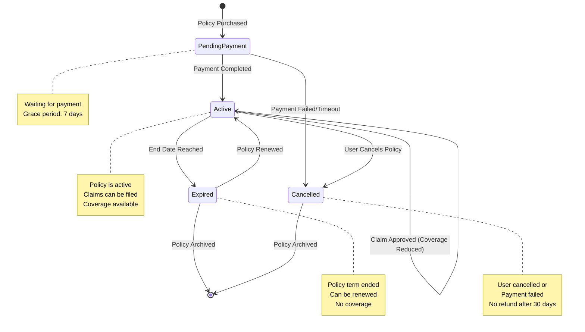
```mermaid
stateDiagram-v2
    [*] --> PendingPayment: Policy Purchased
    
    PendingPayment --> Active: Payment Completed
    PendingPayment --> Cancelled: Payment Failed/Timeout
    
    Active --> Expired: End Date Reached
    Active --> Cancelled: User Cancels Policy
    Active --> Active: Claim Approved (Coverage Reduced)
    
    Expired --> Active: Policy Renewed
    Expired --> [*]: Policy Archived
    
    Cancelled --> [*]: Policy Archived
    
    note right of PendingPayment
        Waiting for payment
        Grace period: 7 days
    end note
    
    note right of Active
        Policy is active
        Claims can be filed
        Coverage available
    end note
    
    note right of Expired
        Policy term ended
        Can be renewed
        No coverage
    end note
    
    note right of Cancelled
        User cancelled or
        Payment failed
        No refund after 30 days
    end note
```

### 8.2 Claim Approval Lifecycle State Diagram

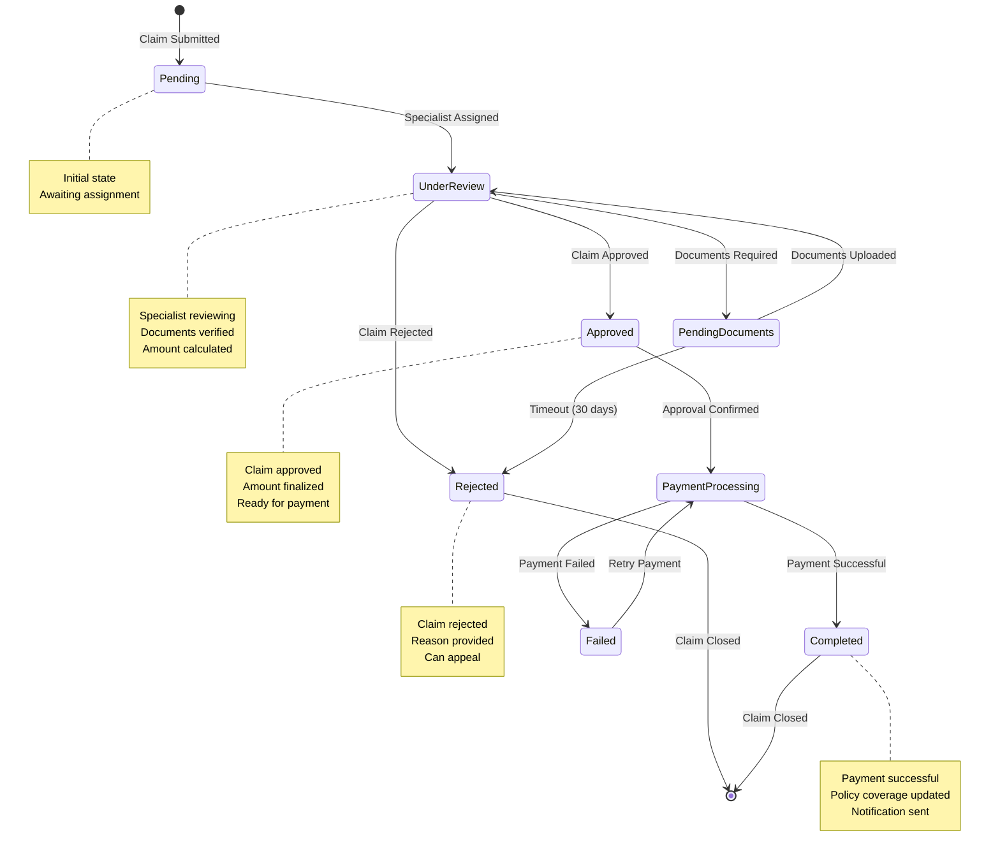
```mermaid
stateDiagram-v2
    [*] --> Pending: Claim Submitted
    
    Pending --> UnderReview: Specialist Assigned
    
    UnderReview --> PendingDocuments: Documents Required
    UnderReview --> Approved: Claim Approved
    UnderReview --> Rejected: Claim Rejected
    
    PendingDocuments --> UnderReview: Documents Uploaded
    PendingDocuments --> Rejected: Timeout (30 days)
    
    Approved --> PaymentProcessing: Approval Confirmed
    
    PaymentProcessing --> Completed: Payment Successful
    PaymentProcessing --> Failed: Payment Failed
    
    Failed --> PaymentProcessing: Retry Payment
    
    Rejected --> [*]: Claim Closed
    Completed --> [*]: Claim Closed
    
    note right of Pending
        Initial state
        Awaiting assignment
    end note
    
    note right of UnderReview
        Specialist reviewing
        Documents verified
        Amount calculated
    end note
    
    note right of Approved
        Claim approved
        Amount finalized
        Ready for payment
    end note
    
    note right of Rejected
        Claim rejected
        Reason provided
        Can appeal
    end note
    
    note right of Completed
        Payment successful
        Policy coverage updated
        Notification sent
    end note
```

### 8.3 Payment Transaction State Diagram

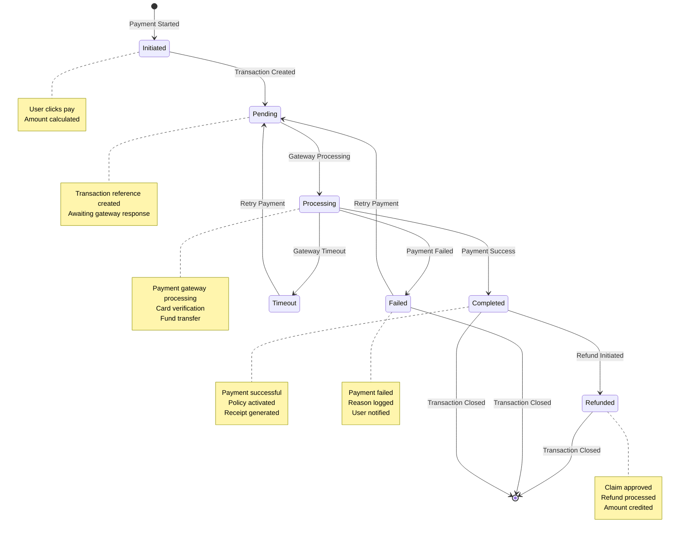
```mermaid
stateDiagram-v2
    [*] --> Initiated: Payment Started
    
    Initiated --> Pending: Transaction Created
    
    Pending --> Processing: Gateway Processing
    
    Processing --> Completed: Payment Success
    Processing --> Failed: Payment Failed
    Processing --> Timeout: Gateway Timeout
    
    Failed --> Pending: Retry Payment
    Timeout --> Pending: Retry Payment
    
    Completed --> Refunded: Refund Initiated
    
    Refunded --> [*]: Transaction Closed
    Failed --> [*]: Transaction Closed
    Completed --> [*]: Transaction Closed
    
    note right of Initiated
        User clicks pay
        Amount calculated
    end note
    
    note right of Pending
        Transaction reference created
        Awaiting gateway response
    end note
    
    note right of Processing
        Payment gateway processing
        Card verification
        Fund transfer
    end note
    
    note right of Completed
        Payment successful
        Policy activated
        Receipt generated
    end note
    
    note right of Failed
        Payment failed
        Reason logged
        User notified
    end note
    
    note right of Refunded
        Claim approved
        Refund processed
        Amount credited
    end note
```

### 8.4 Support Ticket State Diagram

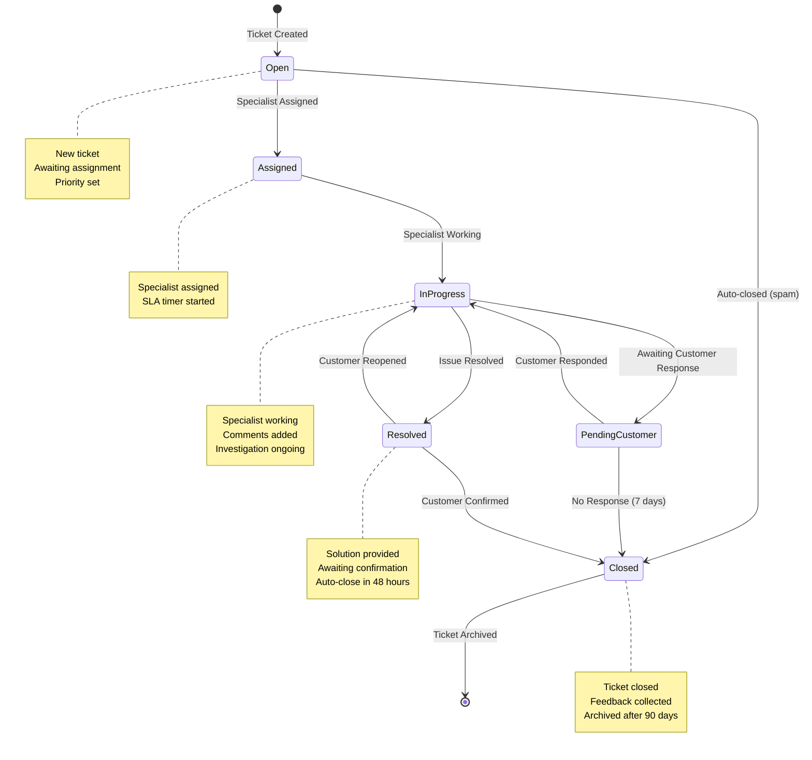
```mermaid
stateDiagram-v2
    [*] --> Open: Ticket Created
    
    Open --> Assigned: Specialist Assigned
    Open --> Closed: Auto-closed (spam)
    
    Assigned --> InProgress: Specialist Working
    
    InProgress --> PendingCustomer: Awaiting Customer Response
    InProgress --> Resolved: Issue Resolved
    
    PendingCustomer --> InProgress: Customer Responded
    PendingCustomer --> Closed: No Response (7 days)
    
    Resolved --> Closed: Customer Confirmed
    Resolved --> InProgress: Customer Reopened
    
    Closed --> [*]: Ticket Archived
    
    note right of Open
        New ticket
        Awaiting assignment
        Priority set
    end note
    
    note right of Assigned
        Specialist assigned
        SLA timer started
    end note
    
    note right of InProgress
        Specialist working
        Comments added
        Investigation ongoing
    end note
    
    note right of Resolved
        Solution provided
        Awaiting confirmation
        Auto-close in 48 hours
    end note
    
    note right of Closed
        Ticket closed
        Feedback collected
        Archived after 90 days
    end note
```

### 8.5 User Account State Diagram

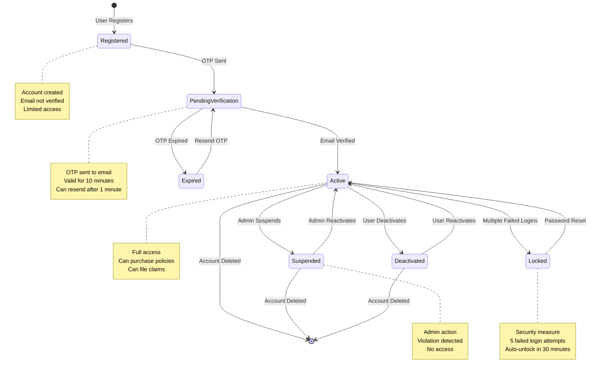
```mermaid
stateDiagram-v2
    [*] --> Registered: User Registers
    
    Registered --> PendingVerification: OTP Sent
    
    PendingVerification --> Active: Email Verified
    PendingVerification --> Expired: OTP Expired
    
    Expired --> PendingVerification: Resend OTP
    
    Active --> Suspended: Admin Suspends
    Active --> Locked: Multiple Failed Logins
    Active --> Deactivated: User Deactivates
    
    Suspended --> Active: Admin Reactivates
    Locked --> Active: Password Reset
    Deactivated --> Active: User Reactivates
    
    Active --> [*]: Account Deleted
    Suspended --> [*]: Account Deleted
    Deactivated --> [*]: Account Deleted
    
    note right of Registered
        Account created
        Email not verified
        Limited access
    end note
    
    note right of PendingVerification
        OTP sent to email
        Valid for 10 minutes
        Can resend after 1 minute
    end note
    
    note right of Active
        Full access
        Can purchase policies
        Can file claims
    end note
    
    note right of Suspended
        Admin action
        Violation detected
        No access
    end note
    
    note right of Locked
        Security measure
        5 failed login attempts
        Auto-unlock in 30 minutes
    end note
```

---

